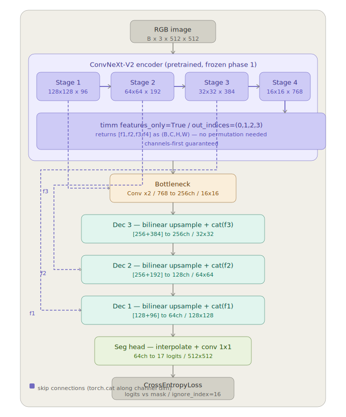
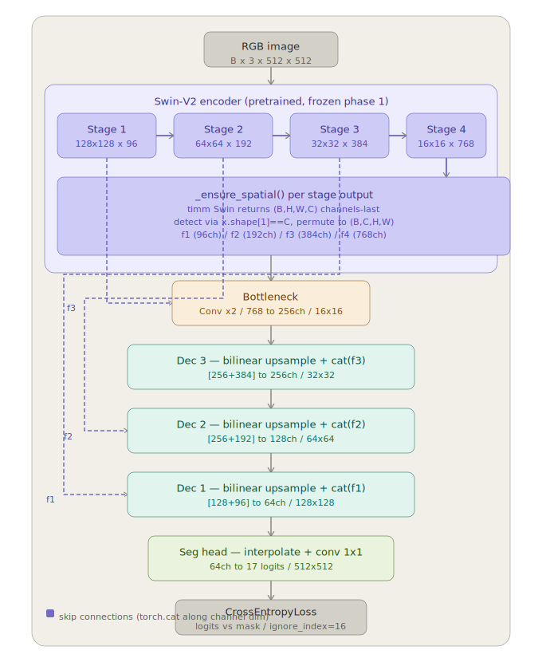

# Fruit Segmentation — Hybrid U-Net Pipeline

Pixel-perfect instance segmentation of fresh and rotten fruits on conveyor belts.
Two backbone options compared: **ConvNeXt-V2** and **Swin Transformer V2**, both wired to a shared custom U-Net decoder.

---

## Architecture

### ConvNeXt-V2 U-Net



ConvNeXt-V2's `features_only=True` mode returns stage outputs directly as channels-first `(B, C, H, W)` — no format conversion needed before the decoder.

---

### Swin-V2 U-Net



Swin-V2 returns stage outputs in channels-last `(B, H, W, C)`. `_ensure_spatial()` detects this by comparing `x.shape[1]` to the known channel count `C` for each stage and permutes to `(B, C, H, W)` before the decoder.

---

## Project structure

```
fruit_segmentation/
├── config/                  # YAML hyperparameter files
│   ├── base_config.yaml     # Shared defaults
│   ├── convnext_unet.yaml   # ConvNeXt-V2 overrides
│   └── swin_unet.yaml       # Swin-V2 overrides
├── data/
│   ├── raw/                 # Original downloaded images
│   └── processed/           # images/ and masks/ ready for training
│       ├── images/{train,val,test}/
│       └── masks/{train,val,test}/
├── dataset/
│   └── fruit_dataset.py     # FruitSegmentationDataset + DataLoader builder
├── models/
│   ├── decoder.py           # Shared DecoderBlock, BottleneckBlock, SegmentationHead
│   ├── convnext_unet.py     # ConvNeXt-V2 U-Net
│   ├── swin_unet.py         # Swin-V2 U-Net
│   └── __init__.py          # build_model factory
├── utils/
│   ├── prepare_dataset.py   # AnyLabeling JSON → grayscale PNG mask pipeline
│   ├── transforms.py        # Albumentations pipelines
│   ├── metrics.py           # mIoU + pixel accuracy accumulator
│   ├── logger.py            # CSV training logger
│   ├── checkpoint.py        # Checkpoint save / load manager
│   └── engine.py            # train_one_epoch / validate_one_epoch
├── train/
│   └── train.py             # Main training script (two-phase)
├── inference/
│   └── inference.py         # Single image or batch prediction
├── visualization/
│   └── plot_metrics.py      # Training curves + model comparison plots
├── tests/                   # pytest test suite
├── notebooks/               # Google Colab training notebook
├── logs/                    # CSV training logs (auto-created)
├── checkpoints/
│   ├── best/                # Best-mIoU checkpoint per model
│   └── latest/              # Periodic epoch checkpoints
├── pyproject.toml
└── README.md
```

---

## Dataset

**Fresh and Rotten Fruits** — 17 classes derived from `folder2label_str.txt` (alphabetical order):

| Index | Class              | Index | Class               |
|-------|--------------------|-------|---------------------|
| 0     | fresh\_apple       | 8     | rotten\_apple       |
| 1     | fresh\_banana      | 9     | rotten\_banana      |
| 2     | fresh\_grape       | 10    | rotten\_grape       |
| 3     | fresh\_guava       | 11    | rotten\_guava       |
| 4     | fresh\_jujube      | 12    | rotten\_jujube      |
| 5     | fresh\_orange      | 13    | rotten\_orange      |
| 6     | fresh\_pomegranate | 14    | rotten\_pomegranate |
| 7     | fresh\_strawberry  | 15    | rotten\_strawberry  |
| 16    | background         |       |                     |

3,200 raw images → 12,335 augmented (rotation, flip, zoom, shear).
Background (index 16) is excluded from loss via `ignore_index=16` in `CrossEntropyLoss`.

---

## Installation

Requires Python ≥ 3.10 and [uv](https://github.com/astral-sh/uv).

```bash
# Install uv (if not already installed)
curl -LsSf https://astral.sh/uv/install.sh | sh

# Clone and install
git clone https://github.com/jibran/fruit-segmentation.git
cd fruit-segmentation
uv sync

# For development extras (linting, tests)
uv sync --extra dev
```

---

## Data preparation

Convert raw AnyLabeling JSON annotations to grayscale PNG masks:

```bash
python utils/prepare_dataset.py \
    --raw_dir "data/raw/Original Image" \
    --out_dir data/processed \
    --target_size 512
```

This produces an 80/10/10 stratified split across all 16 fruit classes. Mask pixel values map directly to class indices (0–15 = fruit, 16 = background).

---

## Training

```bash
# ConvNeXt-V2 U-Net (tiny)
python train/train.py --config config/convnext_unet.yaml --size tiny

# Swin-V2 U-Net (tiny)
python train/train.py --config config/swin_unet.yaml --size tiny

# Different size
python train/train.py --config config/convnext_unet.yaml --size small

# Resume from checkpoint
python train/train.py --config config/convnext_unet.yaml \
    --resume checkpoints/latest/convnext_unet_tiny_epoch010.pth
```

Training runs two phases automatically:

| Phase | Backbone | Epochs | LR (decoder) | LR (backbone) |
|-------|----------|--------|--------------|---------------|
| 1     | Frozen   | 15     | 1e-3         | —             |
| 2     | Unfrozen | 30     | 1e-4         | 1e-5          |

Logs are written to `logs/<model_name>-<YYYYMMDDHHMM>.csv`.

---

## Inference

```bash
# Single image
python inference/inference.py \
    --config config/convnext_unet.yaml \
    --checkpoint checkpoints/best/convnext_unet_tiny_best.pth \
    --input path/to/image.jpg \
    --output predictions/ \
    --overlay

# Entire directory
python inference/inference.py \
    --config config/convnext_unet.yaml \
    --checkpoint checkpoints/best/convnext_unet_tiny_best.pth \
    --input data/processed/images/test/ \
    --output predictions/
```

Outputs:
- `*_mask.png` — grayscale integer mask (pixel = class index)
- `*_overlay.png` — colourised mask blended over original image (with `--overlay`)

---

## Visualisation

```python
from visualization.plot_metrics import (
    plot_training_curves,
    plot_model_comparison,
    compare_logs_from_dir,
)

# Single model curves
plot_training_curves("logs/convnext_unet_tiny-202401011200.csv", show=True)

# Compare all models in logs/
compare_logs_from_dir("logs/", metric="miou")

# Custom comparison
plot_model_comparison(
    ["logs/convnext_unet_tiny-*.csv", "logs/swin_unet_tiny-*.csv"],
    metric="miou",
    phase="val",
)
```

---

## Tests

```bash
# Run all tests
uv run pytest tests/ -v

# Run with coverage
uv run pytest tests/ --cov=. --cov-report=term-missing
```

---

## Google Colab

Open `notebooks/fruit_segmentation_training.ipynb` in Google Colab.
Set runtime to **T4 GPU** and follow the cells in order.

---

## Model sizes

| Model              | Backbone params | Decoder params | Total  |
|--------------------|-----------------|----------------|--------|
| ConvNeXt-V2 Tiny   | 28 M            | ~14 M          | ~42 M  |
| ConvNeXt-V2 Small  | 50 M            | ~14 M          | ~64 M  |
| Swin-V2 Tiny       | 28 M            | ~14 M          | ~42 M  |
| Swin-V2 Small      | 50 M            | ~14 M          | ~64 M  |

---

## Configuration

All hyperparameters live in `config/`.
Override any value from the CLI or by editing the YAML directly:

```yaml
# config/base_config.yaml (excerpt)
training:
  epochs_phase1: 15
  epochs_phase2: 30
  lr_decoder: 1.0e-3
  lr_backbone_phase2: 1.0e-5
  lr_decoder_phase2: 1.0e-4
  scheduler: "cosine"       # "cosine" | "step" | "plateau"
  ignore_index: 16          # background excluded from loss

data:
  image_size: 512           # Must be divisible by 32
  batch_size: 8
  num_classes: 17           # 16 fruit (0-15) + 1 background (16)
```

---

## License

MIT
